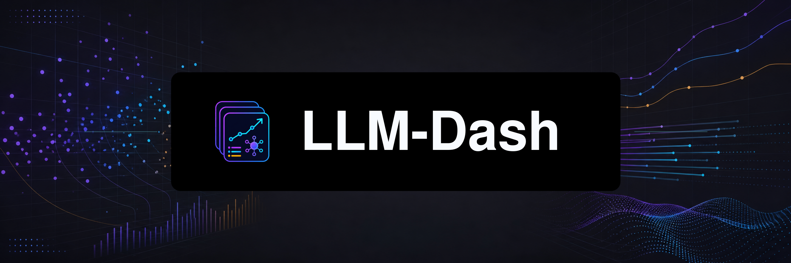

<picture>
  <source media="(prefers-color-scheme: dark)" srcset="assets/brand/repo-banner-dark.png">
  
</picture>

# LLM-Dash

**Local LLM benchmark dashboard with AI-driven daily changelog updates.**

[](https://www.python.org)
[](https://fastapi.tiangolo.com)
[](https://www.sqlite.org)
[](https://sql.js.org)
[](https://github.com/ShxdowCollective/voidware)
[](LICENSE)
[](https://buymeacoffee.com/shxdowenby)

---

<p align="center"><code>track · compare · update — entirely local</code></p>

---

> A no-build, click-to-launch dashboard for tracking LLM benchmarks and daily
> model changelogs. Voidware-powered dark UI. SQLite source of truth. AI agents
> write the updates — you just watch.

## Features

- **Models leaderboard** — sortable table with five benchmark dimensions
  (intelligence, coding, agent capability, speed, cost), tier grades S–F, and
  per-vendor color coding.
- **Interactive charts** — scatter and radar comparisons with selectable model
  profiles.
- **Changelog timeline** — append-only daily entries rendered from Markdown.
- **Stats & analytics** — token usage, cost tracking, duration metrics, and
  per-agent breakdowns across every update run.
- **Settings-first setup** — local subpages configure your BYOK provider,
  models, Exa API key, optional LLM Stats enrichment, and OS-level scheduling.
- **Agent-agnostic updates** — any AI agent (Claude, Codex, Gemini, etc.)
  follows `skill/SKILL.md` to research, score, and commit new data.
- **Zero build runtime** — vanilla HTML/CSS/JS served by a tiny FastAPI server.
- **Works offline** — once launched, the dashboard runs entirely from local
  SQLite + WASM. Internet is only needed for update runs.

## Quick Start

**Requirements:** Python 3.10+ (plus internet access for first-time dependency
install and model updates).

```bash
# macOS / Linux
./install.sh
llm-dash start

# Windows
.\install.bat
llm-dash start
```

The installer creates a local `.venv`, installs dependencies, and registers a
managed `llm-dash` command. `llm-dash start` serves the dashboard on
`127.0.0.1:8787` and opens it in your browser.

First launch shows a setup wizard — there's no default catalog, so seed it from
the **Catalog** step (or run `python scripts/init_db.py` to preseed offline).

> Background mode, release-archive install, reset, desktop shortcuts, and the
> full update workflow are in **[docs/USAGE.md](docs/USAGE.md)**.

## How Updates Work

LLM-Dash separates **reading** (the dashboard) from **writing** (AI agents).
Three ways to trigger an update:

- **Automated** — configure a BYOK provider, then click **Refresh**; the app
  runs `skill/SKILL.md` via the OpenAI Agents SDK.
- **Manual** — with no provider configured, **Refresh** copies an agent-neutral
  prompt for `claude`/`codex` to run in a terminal.
- **Scheduled** — install an OS-level job (systemd / launchd / Task Scheduler)
  for daily, weekly, or monthly runs.

See [docs/USAGE.md](docs/USAGE.md#how-updates-work) for the full workflow.

## Project Layout

```text
LLM-Dash/
├── server.py              # FastAPI app — API routes + static mounts
├── install.sh / .ps1 / .bat   # Idempotent installers
├── llm-dash / llm-dash.cmd    # Local command shims
├── requirements.txt           # Python deps
├── pyproject.toml             # Package metadata + console entry point
├── llm_dash/              # CLI, install, process lifecycle
├── web/                   # Static frontend (vanilla HTML/CSS/JS + vendored libs)
├── data/                  # dash.sqlite source of truth + metrics CSV (generated)
├── changelogs/            # Append-only daily Markdown updates
├── scripts/               # Schema, seeding, update runner, scheduling, release
├── skill/SKILL.md         # Agent-agnostic update contract
└── docs/                  # Architecture, development, usage, scheduling
```

## Troubleshooting

| Problem | Fix |
|---|---|
| `python -m venv` fails on Debian/Ubuntu | Install `python3-venv` and rerun `./install.sh` |
| `llm-dash` not found after install | Open a new terminal, or run `./llm-dash start` from the repo |
| Port 8787 already in use | `llm-dash start --port 9000` |
| First launch shows the setup wizard | Expected — seed from the **Catalog** step |
| Provider connection fails | Verify API key + base URL via Settings "Test connection" |

Full troubleshooting table: **[docs/USAGE.md](docs/USAGE.md#troubleshooting)**.

## Documentation

| Document | Audience | Contents |
|---|---|---|
| [Usage](docs/USAGE.md) | Users | Install variants, background mode, reset, update workflow, troubleshooting |
| [Architecture](docs/ARCHITECTURE.md) | Developers | System design, data flow, schema, component map |
| [Development](docs/DEVELOPMENT.md) | Contributors | Local setup, conventions, testing, adding features |
| [Update Protocol](skill/SKILL.md) | AI Agents | Step-by-step update contract |
| [Contributing](CONTRIBUTING.md) | Contributors | How to set up, branch, and open a PR |

## License

[MIT](LICENSE) © 2026 Phxntom
