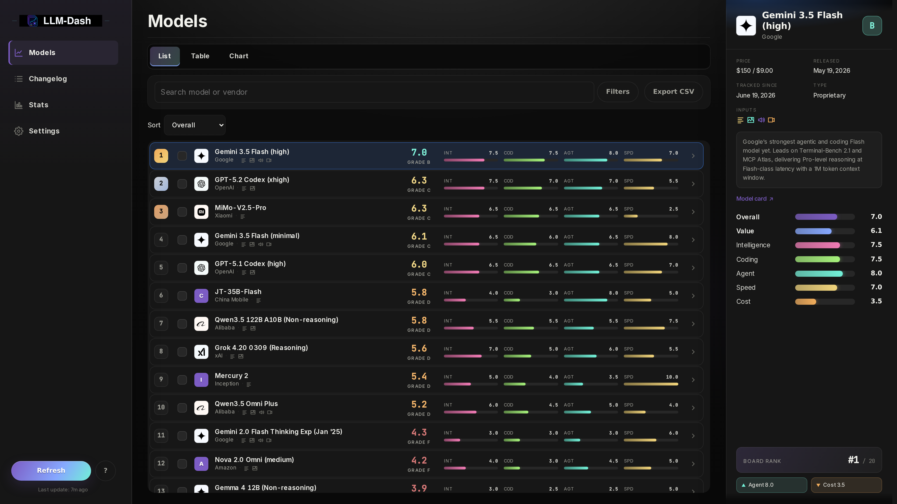
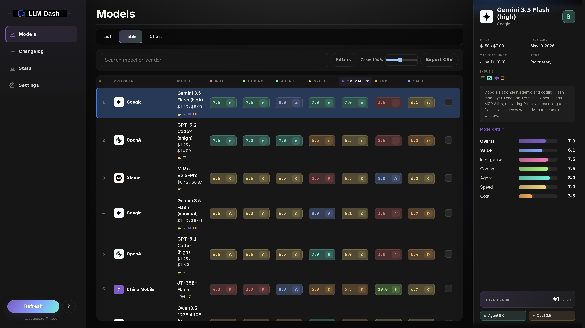
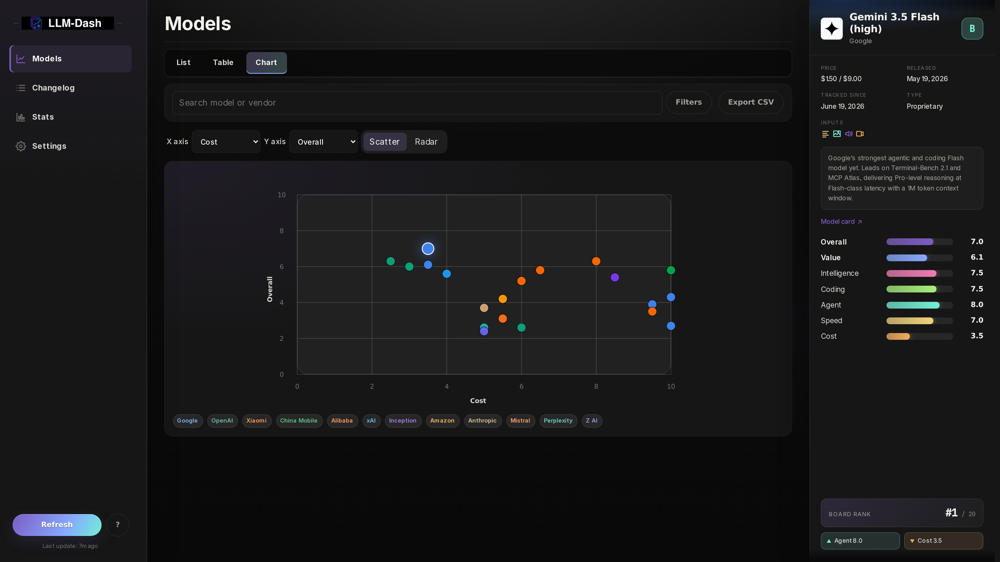
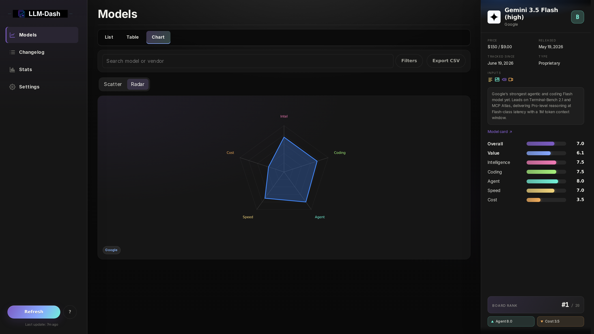
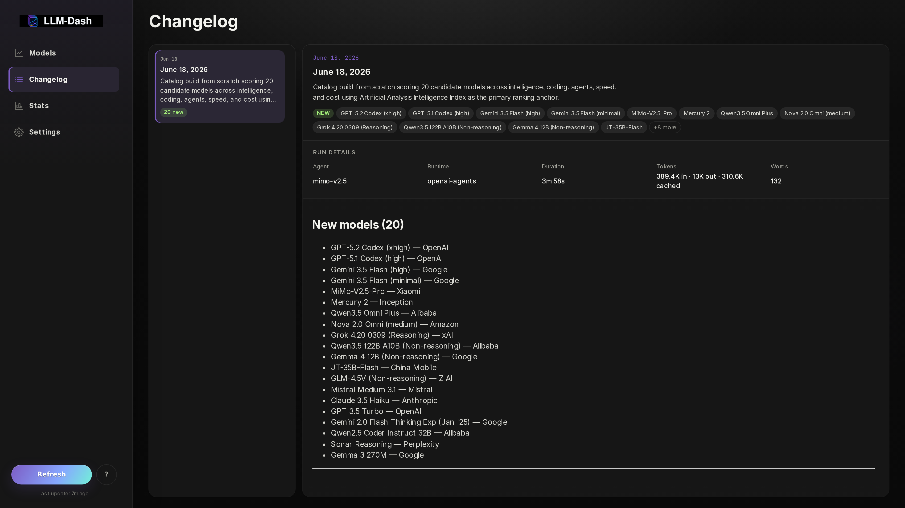
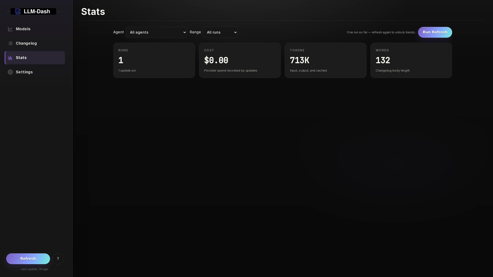
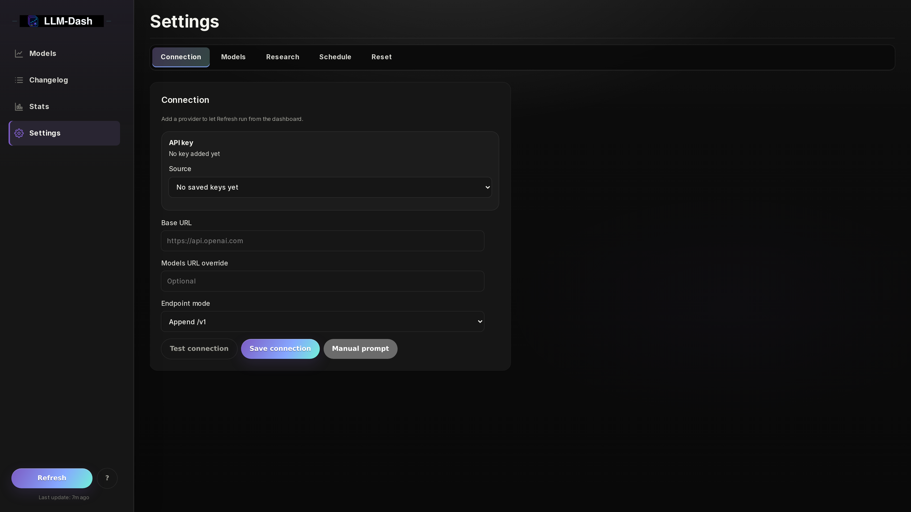

# Screenshots

Captured from a live LLM-Dash instance seeded with **real data from the top 20
[Artificial Analysis](https://artificialanalysis.ai/) intelligence-ranked
models** (`scripts/seed_catalog.py --preset aa --index intelligence --count 20`).
Dark theme, 1920×1080 viewport at 2× (3840×2160) for crispness.

> Provider credentials are intentionally left unconfigured in these captures, so
> the Settings/Connection surface shows the clean first-run state — no keys are
> rendered.

## Models — leaderboard (list)

The default landing surface: ranked models with five benchmark dimensions and a
live scorecard rail for the selected model.

## Models — leaderboard (table)

The same catalog as a sortable table across intelligence, coding, agent, speed,
overall, and cost — with tier grades and per-vendor color coding.

## Models — charts

Scatter and radar comparisons with selectable axes and model profiles.

## Changelog

Append-only daily entries rendered from Markdown, with per-run details (agent,
runtime, duration, tokens).

## Stats

Token usage, cost, duration, and word-count metrics across every update run.

## Settings

Settings-first setup: configure a BYOK provider, research keys, and scheduling.

